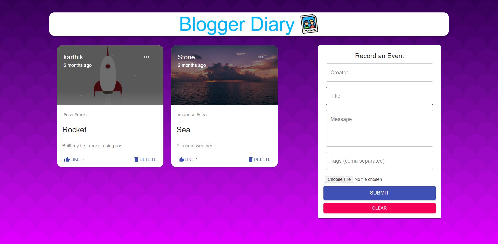

<div align="center">
    <h1>Blogger Diary</h1>
    <p>This is a diary which is used to make note of your favourite memories</p>
    <p>This application is built with React, Node.js, Express & MongoDB</p>
</div>



## Run it on your machine

1. Clone the project

   ```sh
   git clone https://github.com/karthik181194/Blogger-Diary.git
   ```

1. Install the dependencies and run commands for client server seperately

   ```sh
   npm install
   ```

3. Start the development server

   ```sh
   npm start
   ```

<div align="center">
    <p>
        Built with <a href="https://www.reactjs.org/" target="_blank">React.js</a>
    </p>
</div>